# teaching-answer-card-tool

答题卡检测

### 1、多张图连续检测
功能：如果一套试卷的答题卡数量大于1，也支持检测，并且按试题顺序拼凑检测结果（即下面这套试卷假设存在位于第二张答题卡上的第八题，支持连续检测）

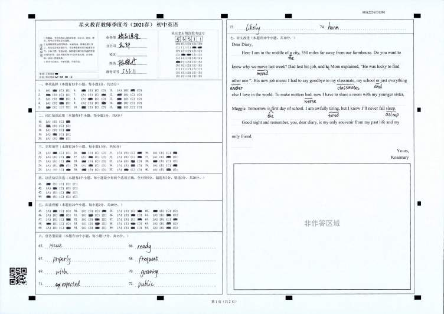

### 2、试题切割
功能：
- 将答题卡按试题切成一张张图片，并将图片与题序一一对应
 程序能知道第六大题存在2张图片

第一题：
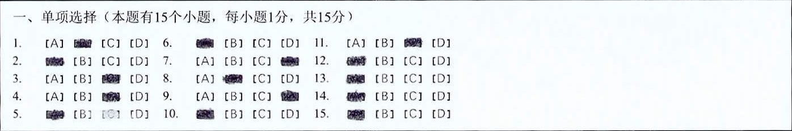

第二题：
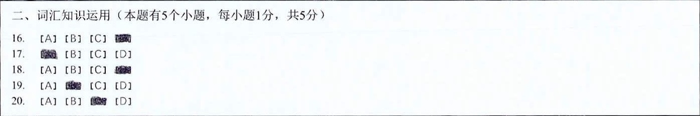

第三题：
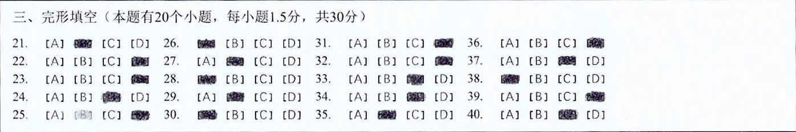

第四题：
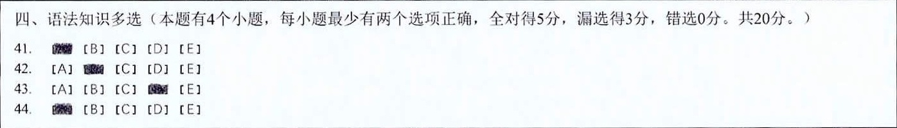

第五题：
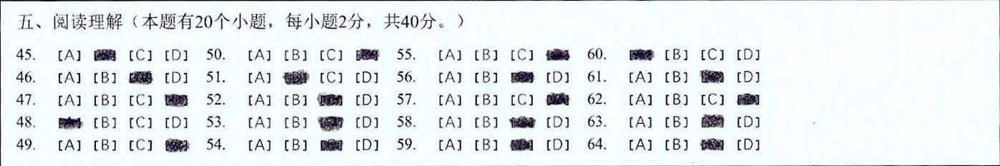

第六题（程序能知道第六大题存在2张图片）：
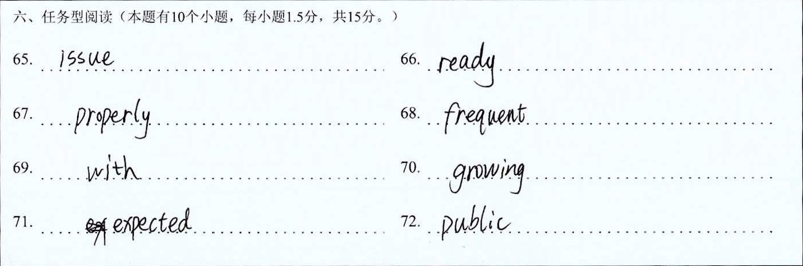

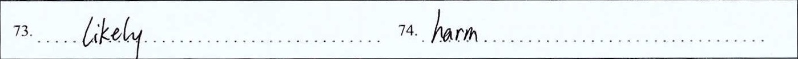

第七题：

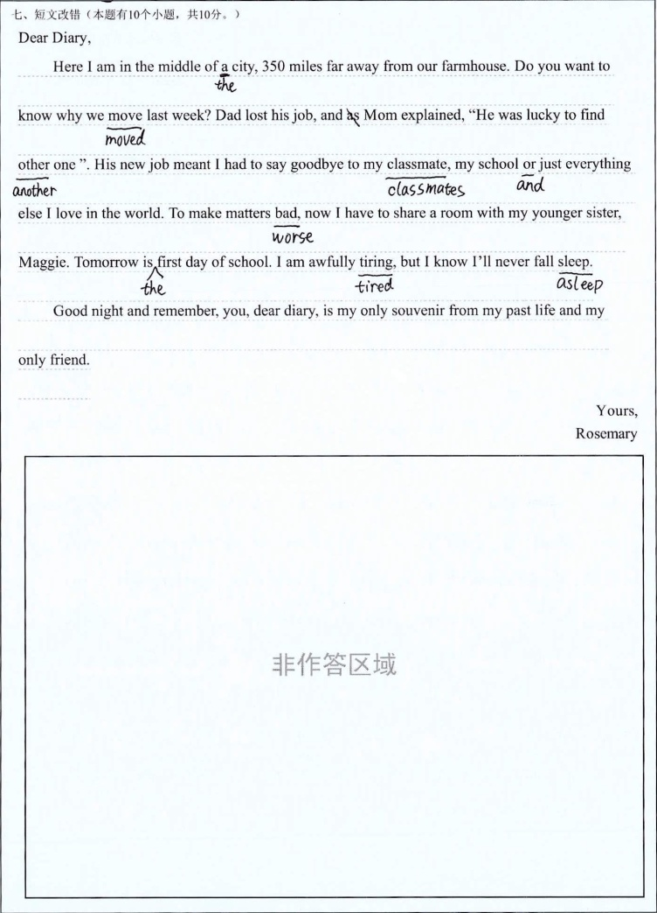

### 3、学生考号识别
#### 1）切割出学生手写的准考证号

#### 2）识别出学生填充的准考证号

识别结果：53311

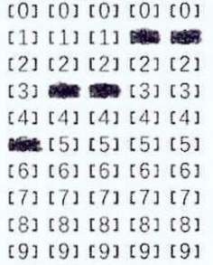

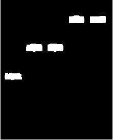

### 4、选择题自动批改检测
识别结果（key：题序，value：答案的索引）：

 {1: [2], 2: [1], 3: [3], 4: [3], 5: [1], 6: [1], 7: [4], 8: [2], 9: [4], 10: [1], 11: [3], 12: [1], 13: [1], 14: [1], 15: [1]}

选择题自动批改支持以下变化
- 无论试题的候选项有四个还是五六七八个，都支持识别
- 答案无论是一个还是多个，都支持识别
- 选择题，无论是竖着排列，还是横着排列，还是乱序排序，支持识别

原题：

识别出所有的轮廓：

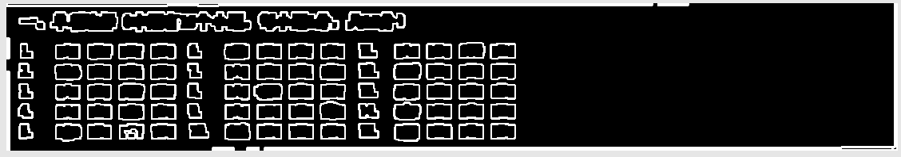

筛选出答案：

筛选出候选框：

筛选出题序：

根据题序及其坐标，寻找到对应题序的答案与候选框，进行自动批改

### 5、特殊逻辑处理
（1）填充区域出现连接的情况，只要连接的不是太过分，都支持识别

 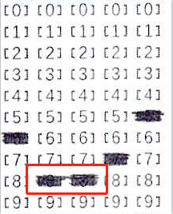

 

（2）填充区域，先填充，再擦除，存在曾经填充过的痕迹，目前已经优化，支持准确识别

 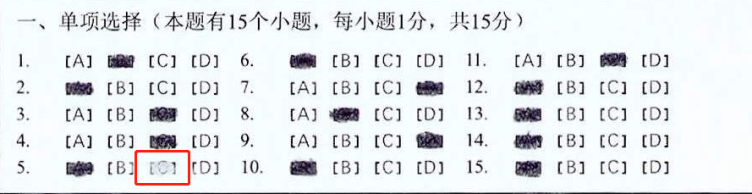

